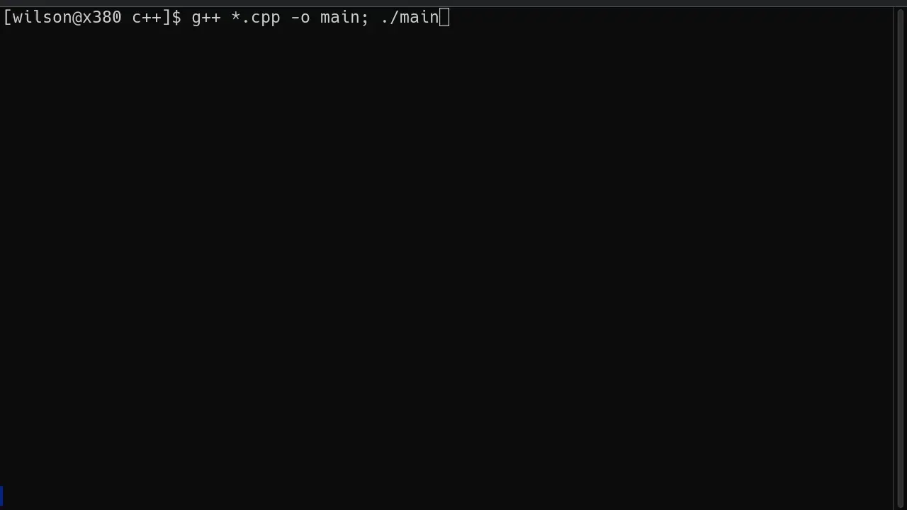

# Tugas Praktikum DPBO #1

Dibuat untuk menyelesaikan TP1 DPBO

## Janji

Saya Willsoon Tulus Parluhutan Simanjuntak dengan NIM 2404756 mengerjakan evaluasi Tugas Praktikum 1 dalam mata kuliah Desain Pemrograman Berorientasi Objek untuk keberkahanNya maka saya tidak melakukan kecurangan seperti yang telah dispesifikasikan. 

Aamiin.

## Penjelasan Desain dan Code Flow

Program memiliki satu kelas bernama "Barang", sesuai dengan peta UML berikut:

Variabel tersebut terdiri dari:

1. ID (int)
2. Nama (string)
3. Deskripsi (string)
4. Tipe (string)
5. Stok (int)

Untuk versi CLI memiliki menu sebagai berikut:

1. Tambah barang
2. Tampilkan List Barang
3. Update Barang
4. Hapus Barang
5. Cari Barang (berdasarkan nama barang)
0. Keluar dari program

## Deskripsi kode program

Untuk C++, Java, dan Python, menggunakan CLI dan memiliki tampilan antarmuka yang sama. Terdapat ketentuan operasional untuk versi CLI:

1. Penyimpanan barang menggunakan Array of Objects, dan memiliki batas sebanyak 1024 barang yang berbeda.
2. Update barang bisa memilih satu atribut, atau seluruh atribut sekaligus.
3. Menghapus barang tidak akan mensortir ulang ID barang yang ada.
4. Pencarian barang dilakukan berdasarkan kandungan string inputan di nama barang.

## Preview operasional program
C++:

Java:

Python:

PHP:
