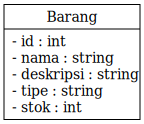
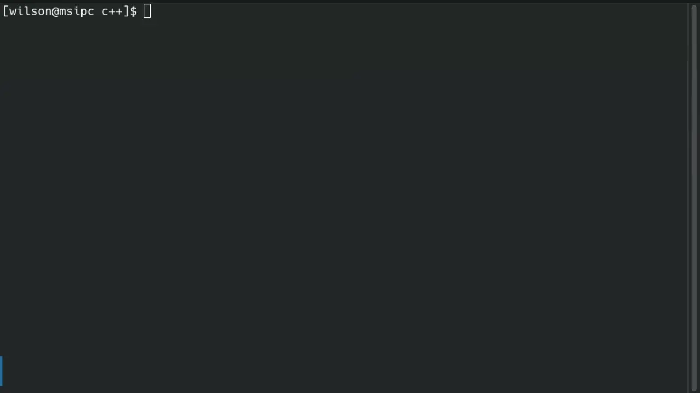

# Tugas Praktikum DPBO #1

Dibuat untuk menyelesaikan TP1 DPBO

## Janji
Saya Willsoon Tulus Parluhutan Simanjuntak mengerjakan evaluasi Tugas Praktikum 1 dalam mata kuliah Desain Pemrograman Berorientasi Objek untuk keberkahanNya maka saya tidak melakukan kecurangan seperti yang telah dispesifikasikan. 

Aamiin.

## Penjelasan Desain dan Code Flow

## Dokumentasi jalannya kode program

C++:

Java:

Python:

PHP:
